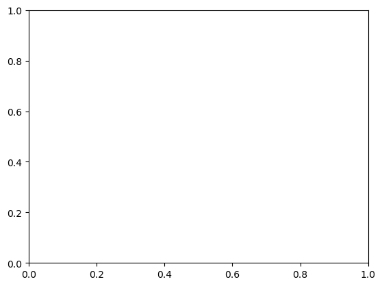

Data viz - Introduction to Visualization

<br>

## [ special ]
- 학습목표
    - 목적에 따라 시각화를 선택하고 사용할 수 있다. 
    - 시각화 결과를 효과적으로 수용할 수 있다.

# 1. 시각화의 요소 상태

## 데이터 이해하기
- 데이터셋의 종류
    1. 정형데이터 
        - 테이블형태로 제공되는 데이터 (csv,tsv)
        - 데이터 간 관계, 비교
    2. 시계열데이터
        - 시간 흐름에 따른 데이터
        - 추세, 계절성, 주기성 등을 살핌
    3. 지리/지도 데이터
        - 거리, 경로, 분포 등 다양한 실사용
    4. 관계 데이터
        - 객체와 객체 간의 관계를 시각화
        - 객체는 node, 관계는 link
        - 크기 색, 수 등으로 객체와 관계의 가중치를 표현
    5. 계층적 데이터
        - 관계 중에서도 포함관계가 분명한 데이터
        - Tree, Treemap, Sunburst등이 대표적

- 데이터의 종류 
    1. 수치형
        - 연속형 : 길이, 무게 등
        - 이산형 : 주사위 눈금, 사람 수 등
    2. 범주형
        - 명목형 : 혈액형, 종교, MBTI 등
        - 순서형 : 학년, 별점 ,등급 등

## 시각화 이해하기
- 전주의적 속성 
    - Pre-attentive Attribute
    - 주의를 주지 않아도 인지하게 되는 요소
    - 동시에 사용하면 인지하기 어려움
        - 시각적 분리(visual pop-out)

<br>

# 2. Python 과 Matplotlib


```python
import numpy as np
import matplotlib as mp1 

print(f'numpy version : {np.__version__}')
print(f'matplolib version : {mp1.__version__}')
```

    numpy version : 1.23.1
    matplolib version : 3.5.2


```python
import matplotlib.pyplot as plt
```

## 기본 Plot 

- Figure와 Axes
- Figure는 큰 틀이라 서브플롯을 최소 1개 이상 추가해야 한다


```python
fig = plt.figure()
plt.show()
```


    <Figure size 640x480 with 0 Axes>


```python
fig = plt.figure()
ax = fig.add_subplot()
plt.show()
```


    

    


그래프의 사이즈는 figure의 사이즈로 서브플롯 ax의 사이즈를 조정  
가로, 세로 길이(inch 단위)를 튜플형대로 figsize 파라미터에 전달하여 조정


```python
fig = plt.figure(figsize=(12,7))
ax = fig.add_subplot()
plt.show()
```


    
![png]2022-10-06-bc15/output_7_0.png)
    


2개 이상 그리고 싶다면 위치를 지정해주어야 한다


```python
fig = plt.figure()
ax = fig.add_subplot(121) ## 세로 1개, 가로 2개
# ax = fig.add_subplot(1,2,1)
ax = fig.add_subplot(122)
plt.show()
```


    

    


```python
fig = plt.figure()
ax = fig.add_subplot(211) ## 세로 1개, 가로 2개
# ax = fig.add_subplot(1,2,1)
ax = fig.add_subplot(212)
plt.show()
```


    

    


### plt로 그래프 그리기
list [1,2,3] 데이터를 ax에 그린다면?


```python
fig = plt.figure()
ax = fig.add_subplot()

x = np.array([1,2,3])
plt.plot(x)
plt.show()
```


    

    


```python
fig = plt.figure()
x1 = [1,2,3]
x2 = [3,2,1]

ax1 = fig.add_subplot(211)
plt.plot(x1)
ax2 = fig.add_subplot(212)
plt.plot(x2)

plt.show()
```


    

    


조금 더 pythonic하게 구현하려면?

### 서브플롯 객체 ax에 그리기
Pyplot API : 순차적 방법  
객체지향(object-oriented) API : 그래프에서 각 객체에 대해 직접적으로 수정하는 방법


```python
fig = plt.figure()
x1 = [1,2,3]
x2 = [3,2,1]

ax1 = fig.add_subplot(211)
ax2 = fig.add_subplot(212)

ax1.plot(x1)
ax2.plot(x2)
plt.show()
```


    

    


## Plot의 요소들 알아보기
1. 한 서브 플롯에서 여러 개 그리기  
ax에는 동시에 다양한 그래프를 그릴 수 있습니다.


```python
fig = plt.figure()
ax = fig.add_subplot(111)
ax.plot([1,1,1])
ax.plot([1,2,3])
ax.plot([3,3,3])
plt.show()
```


    

    


2. 색상 지정하기  
색을 직접 명시할 수 있다. `color`파라미터를 통해 전달


```python
fig = plt.figure()
ax = fig.add_subplot(111)
ax.plot([1,1,1], color='r') # 한 글자로 정하는 색상
ax.plot([2,2,2], color='forestgreen') # color name
ax.plot([3,3,3], color='#000000') # hex code
plt.show()
```


    

    


3. 텍스트 사용하기  
정보를 추가하기 위해 텍스트를 사용할 수도 있다


```python
fig = plt.figure()
ax = fig.add_subplot(111)
ax.plot([1,1,1], label='1') 
ax.plot([2,2,2], label='2') 
ax.plot([3,3,3], label='3')
ax.legend()
plt.show()
```


    

    


```python
fig = plt.figure()
ax1 = fig.add_subplot(1,2,1)
ax2 = fig.add_subplot(1,2,2)
ax1.set_title('ax1')
ax2.set_title('ax2')
fig.suptitle('fig') #super
plt.show()
```


    

    


ax에서 특정 데이터를 변경하는 경우 .set_{}{} 형태의 메서드가 많다.  
set으로 세팅하는 정보들은 반대로 해당 정보를 받아오는 경우에는 .get_{}{} 형태의 메서드를 사용합니다


```python
fig = plt.figure()
ax = fig.add_subplot(111)
ax.plot([1,1,1], label='1')
ax.plot([2,2,2], label='2')
ax.plot([3,3,3], label='3')
ax.set_title('Basic Plot')
ax.legend()

print(ax.get_title())
plt.show()
```

    Basic Plot


    

    


축은 `ticks` 와 `ticklabels` 로 구분된다.  
`ticks`은 축에 적히는 수 위치와 지정한다


```python
fig = plt.figure()
ax = fig.add_subplot(111)
ax.plot([1,1,1], label='1')
ax.plot([2,2,2], label='2')
ax.plot([3,3,3], label='3')
ax.set_title('Basic Plot')
ax.set_xticks([0,1,2])
ax.legend()

plt.show()
```


    

    


```python
fig = plt.figure()
ax = fig.add_subplot(111)
ax.plot([1,1,1], label='1')
ax.plot([2,2,2], label='2')
ax.plot([3,3,3], label='3')
ax.set_title('Basic Plot')
ax.set_xticks([0,1,2])
ax.set_xticklabels(['zero','one','two']) # ticklabels 은 축에 적히는 텍스트를 수정
ax.legend()

plt.show()
```


    

    


```python
fig = plt.figure()
ax = fig.add_subplot(111)
ax.plot([1,1,1], label='1')
ax.plot([2,2,2], label='2')
ax.plot([3,3,3], label='3')
ax.set_title('Basic Plot')
ax.set_xticks([0,1,2])
ax.set_xticklabels(['zero','one','two'])

ax.text(x=1, y=2, s='This is Text')
ax.legend()

plt.show()
```


    

    


```python
fig = plt.figure()
ax = fig.add_subplot(111)
ax.plot([1,1,1], label='1')
ax.plot([2,2,2], label='2')
ax.plot([3,3,3], label='3')
ax.set_title('Basic Plot')
ax.set_xticks([0,1,2])
ax.set_xticklabels(['zero','one','two'])

ax.annotate(text='This is Annotate', xy=(1,2))
ax.legend()

plt.show()
```


    

    


annotate는 화살표 등을 추가 할 수 있다


```python
fig = plt.figure()
ax = fig.add_subplot(111)
ax.plot([1,1,1], label='1')
ax.plot([2,2,2], label='2')
ax.plot([3,3,3], label='3')
ax.set_title('Basic Plot')
ax.set_xticks([0,1,2])
ax.set_xticklabels(['zero','one','two'])

ax.annotate(text='This is Annotate', xy=(1,2),xytext=(1.2,2.2),arrowprops=dict(facecolor='black'),)
ax.legend()

plt.show()
```


    

    

